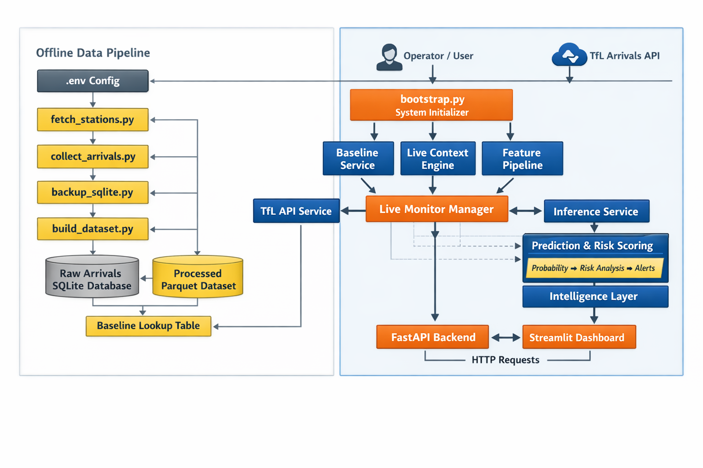

# DelaySense - Transit Intelligence System

Real-time ML-powered early warning system that predicts whether a London Underground arrival is likely to become delayed in the next few minutes.

## Why it matters
Passenger information systems usually show the current state of arrivals, but they do not warn when a currently normal-looking arrival is about to deteriorate. DelaySense turns live arrival predictions into proactive delay-risk intelligence for monitoring and prioritization.

## What this repository contains
- live TfL (Transportation for London) data ingestion pipeline
- time-aware feature engineering with rolling statistics and baselines
- forecasting-based ML models for short-horizon delay risk
- FastAPI backend for inference
- Streamlit dashboard for interactive monitoring
- artifact-based deployment workflow

## 🌟 Overview

TfL Delay Intelligence is a **real-time monitoring and early-warning system** designed to identify which train arrivals are most likely to become delayed in the next few minutes.

Instead of answering:

> “When is the train arriving?”

This system answers:

> **“Which arrivals are at risk of becoming problematic next?”**

---

## 🎯 What This Project Demonstrates

This project is not just a model — it is a **full ML product system**:

* 🔄 Real-time TfL API ingestion
* 🧠 Context-aware feature engineering (rolling + baseline)
* 📈 Forecasting-based ML predictions
* ⚙️ FastAPI backend for inference + monitoring
* 🖥 Streamlit dashboard for product interaction
* 🧩 Artifact-based ML deployment (joblib + metadata)

👉 A complete pipeline from **raw data → deployed monitoring system**

---

## 🧠 Problem Statement

TfL provides arrival predictions like:

> “Train arrives in 5 minutes”

But this lacks context:

* Is 5 minutes normal?
* Is it trending worse?
* Should this be monitored?

---

## 💡 Solution

For each arrival, the system computes:

👉 **Delay likelihood (0–1)**

> Probability that the arrival will become delayed in the next 5 minutes

This enables:

* early warning
* prioritization
* operational awareness

---

## 🔮 Forecasting Approach

At time `t`, predict delay at `t + H`.

Example:

* At 23:05 → predict delay at 23:10

This makes the system:

* proactive ✔️
* realistic ✔️
* operationally useful ✔️

---

## ⚙️ System Architecture

<p align="center">
  
</p>

<p align="center">
  <em>End-to-end architecture of the TfL Delay Intelligence system</em>
</p>

The system consists of 5 layers:

### 1. Live Data Layer

* TfL Arrivals API (30s polling)

### 2. Historical Data Layer

* SQLite → Parquet datasets

### 3. Context Layer

* rolling 10-min features
* baseline lookup

### 4. ML Layer

* probability-based delay prediction

### 5. Product Layer

* FastAPI backend
* Streamlit dashboard

---

## 🔄 End-to-End Workflow

### 1. Data Collection

```bash
python scripts/collect_arrivals.py
```

* polls TfL API
* stores snapshots in SQLite

---

### 2. Dataset Construction

```bash
python scripts/build_dataset.py
```

* builds Parquet dataset
* creates rolling features
* generates forecasting targets

---

### 3. Model Training

```bash
python modeling/train.py
```

* trains models with time-aware split

---

### 4. Model Validation

```bash
python modeling/validate_model_artifact.py <model_path>
```

* ensures compatibility with inference layer

---

### 5. Run Backend

```bash
python -m uvicorn app.api.main:app --reload
```

---

### 6. Run Dashboard

```bash
streamlit run app/ui/streamlit_app.py
```

---

## 🧩 Model Artifacts & Versioning

Multiple model variants are supported:

* LightGBM (v2, horizon 300s)
* XGBoost variants

Artifacts include:

* model
* feature contract
* metadata
* input type
* threshold info

Active model is defined in:

```python
app/config/settings.py
```

---

## 🎭 Demo Mode vs 🌍 Live Mode

### 🎭 Demo Mode

* curated scenarios
* strong visual storytelling

### 🌍 Live Mode

* real-time TfL data
* reflects actual network conditions

👉 Both modes use the same model and logic — only data differs.

---

## ⏳ Live Context & Rolling Features

* system stores recent arrivals in memory
* rolling features computed over ~10 minutes

### Warm-up behavior

* first few minutes → limited context
* after ~10 minutes → stable predictions

---

## 📊 Dataset & Features

Each row =

> one API snapshot of one arrival prediction

### Key features

* `time_to_station`
* rolling stats (10 min)
* baseline median
* deviation from baseline
* temporal features

---

## 🤖 Models

Models explored:

* Logistic Regression
* Random Forest
* LightGBM
* XGBoost

Current deployed model:

👉 **LightGBM (5-min horizon)**

---

## 🌐 API Endpoints

### Health

```http
GET /health
```

### Predict

```http
POST /predict
```

### Sample

```http
GET /sample
```

### Live Monitoring

```http
GET /monitor/live
```

---

## 🖥 Dashboard Features

* monitored arrivals table
* delay likelihood (%)
* risk prioritization
* selected arrival deep dive
* trend visualization
* explanation layer

---

## 📂 Project Structure

```text
app/        → runtime application (API + UI + services)
scripts/    → data ingestion + dataset building
data/       → processed datasets
modeling/   → training + validation scripts
docs/       → documentation + architecture
```

---

## ⚙️ Setup Instructions

### macOS / Linux

```bash
pyenv local 3.11.3
python -m venv .venv
source .venv/bin/activate
pip install --upgrade pip
pip install -r requirements.txt
```

---

### Windows (PowerShell)

```powershell
pyenv local 3.11.3
python -m venv .venv
.venv\Scripts\Activate.ps1
python -m pip install --upgrade pip
pip install -r requirements.txt
```

---

### Windows (Git Bash)

```bash
pyenv local 3.11.3
python -m venv .venv
source .venv/Scripts/activate
pip install --upgrade pip
pip install -r requirements.txt
```

---

## 🔑 Environment Variables

```env
TFL_APP_ID=your_app_id
TFL_APP_KEY=your_app_key
DB_PATH=data/raw/tfl_arrivals.sqlite
POLL_SECONDS=30
```

---

## ⚠️ Notes

* SQLite data grows large
* rolling features need warm-up
* live mode may appear stable (real-world effect)
* demo mode ensures strong presentation

---

## 🚀 Key Highlights

* real-time ML system
* forecasting-based prediction
* feature pipeline + live context
* artifact-based deployment
* end-to-end product architecture

---

## 🔮 Future Improvements

* full network coverage
* external data integration
* advanced models (sequence models)
* alerting system
* cloud deployment

---

## 👥 Authors

* Mayank Vashistha
* Peter Furtado
* Killian Schmiers

---

## 🏁 Final Note

This project demonstrates how:

> **raw transit data → contextual intelligence → actionable insight**

can be built into a real-world ML system.

---
