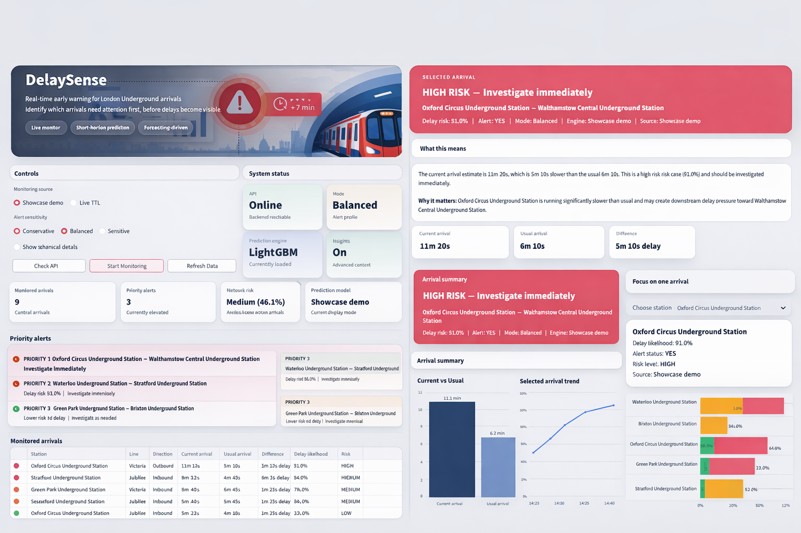

# DelaySense - Transit Intelligence System

[](https://delaysense-transit-intelligence.streamlit.app/)
[](https://delaysense-transit-intelligence.onrender.com/health)
[](https://delaysense-transit-intelligence.onrender.com/docs)


Real-time ML-powered early warning system that predicts whether a London Underground arrival is likely to become delayed in the next few minutes, now deployed as a live end-to-end product with a FastAPI backend and Streamlit dashboard.

## Live Deployment

- **Live App:** https://delaysense-transit-intelligence.streamlit.app/
- **Backend API:** https://delaysense-transit-intelligence.onrender.com/
- **API Health:** https://delaysense-transit-intelligence.onrender.com/health
- **API Docs:** https://delaysense-transit-intelligence.onrender.com/docs

DelaySense is now publicly deployed as a real-time ML-powered early warning system for London Underground delay risk. The current live version includes a FastAPI backend, a Streamlit monitoring dashboard, live TfL-based polling, and artifact-based model inference.

<a id="demo"></a>
## 💻 Demo
<p align="center">
  
</p>

<p align="center">
  <em>Final dashboard of DelaySense</em>
</p>

## Contents

- [Why it matters](#why-it-matters)
- [What this repository contains](#what-this-repository-contains)
- [Overview](#overview)
- [What This Project Demonstrates](#what-this-project-demonstrates)
- [Problem Statement](#problem-statement)
- [Solution](#solution)
- [Forecasting Approach](#forecasting-approach)
- [Key Insight](#key-insight)
- [System Architecture](#system-architecture)
- [End-to-End Workflow](#end-to-end-workflow)
- [Model Artifacts & Versioning](#model-artifacts--versioning)
- [Demo Mode vs Live Mode](#demo-mode-vs-live-mode)
- [Live Context & Rolling Features](#live-context--rolling-features)
- [Dataset & Features](#dataset--features)
- [Models](#models)
- [API Endpoints](#api-endpoints)
- [Dashboard Features](#dashboard-features)
- [Project Structure](#project-structure)
- [Setup Instructions](#setup-instructions)
- [Environment Variables](#environment-variables)
- [Run it quickly](#run-it-quickly)
- [Notes](#notes)
- [Key Highlights](#key-highlights)
- [Future Improvements](#future-improvements)
- [Authors](#authors)
- [Final Note](#final-note)

<a id="why-it-matters"></a>
## Why it matters
Passenger information systems usually show the current state of arrivals, but they do not warn when a currently normal-looking arrival is about to deteriorate. DelaySense turns live arrival predictions into proactive delay-risk intelligence for monitoring and prioritization.

<a id="what-this-repository-contains"></a>
## What this repository contains
- live TfL (Transport for London) data ingestion pipeline
- time-aware feature engineering with rolling statistics and baseline context
- forecasting-based ML models for short-horizon delay risk prediction
- FastAPI backend for inference and live monitoring
- Streamlit dashboard for real-time interaction and prioritization
- artifact-based deployment workflow using packaged model metadata
- publicly deployed application stack (Render + Streamlit Community Cloud)

<a id="overview"></a>
## 🌟 Overview

DelaySense is a **real-time monitoring and early-warning system** designed to identify which train arrivals are most likely to become delayed in the next few minutes.

Instead of answering:

> “When is the train arriving?”

This system answers:

> **“Which arrivals are at risk of becoming problematic next?”**

---

<a id="what-this-project-demonstrates"></a>
## 🎯 What This Project Demonstrates

This project is not just a model - it is a complete deployed ML product system:

* 🔄 Real-time TfL API ingestion
* 🧠 Context-aware feature engineering using rolling and baseline signals
* 📈 Forecasting-based ML predictions for future delay risk
* ⚙️ FastAPI backend for inference and live monitoring
* 🖥 Streamlit dashboard for decision-support interaction
* 🧩 Artifact-based ML deployment with model metadata and feature contracts
* ☁️ Public cloud deployment using Render and Streamlit Community Cloud

👉 A full pipeline from raw transit data to a live decision-support product.

---

<a id="problem-statement"></a>
## 🧠 Problem Statement

TfL provides arrival predictions like:

> “Train arrives in 5 minutes”

But this lacks context:

* Is 5 minutes normal?
* Is it trending worse?
* Should this be monitored?

---

<a id="solution"></a>
## 💡 Solution

For each arrival, the system computes:

👉 **Delay likelihood (0–1)**

> Probability that the arrival will become delayed in the next 5 minutes

This enables:

* early warning
* prioritization
* operational awareness

---

<a id="forecasting-approach"></a>
## 🔮 Forecasting Approach

At time `t`, predict delay at `t + H`.

Example:

* At 23:05 → predict delay at 23:10

This makes the system:

* proactive ✔️
* realistic ✔️
* operationally useful ✔️
---
<a id="key-insight"></a>
## 📊 Key Insight

Initial modeling attempts treated delay prediction as a classification problem on current data, which led to leakage and trivial learning.

The project was reframed as a **time-aware forecasting problem**:
predicting whether an arrival will become delayed in the future (t + H).

This shift enabled meaningful predictions and realistic deployment.

---

<a id="system-architecture"></a>
## ⚙️ System Architecture

<p align="center">
  
</p>

<p align="center">
  <em>End-to-end architecture of the DelaySense system</em>
</p>

The system consists of 5 layers:

### 1. Live Data Layer

* TfL Arrivals API (30s polling)

### 2. Historical Data Layer

* SQLite → Parquet datasets

### 3. Context Layer

* rolling 10-min features
* baseline lookup

### 4. ML Layer

* probability-based delay prediction

### 5. Product Layer

* FastAPI backend
* Streamlit dashboard

---

<a id="end-to-end-workflow"></a>
## 🔄 End-to-End Workflow

### 1. Data Collection

```bash
python scripts/collect_arrivals.py
```

* polls TfL API
* stores snapshots in SQLite

---

### 2. Dataset Construction

```bash
python scripts/build_dataset.py
```

* builds Parquet dataset
* creates rolling features
* generates forecasting targets

---

### 3. Model Training

```bash
python modeling/train.py
```

* trains models with time-aware split

---

### 4. Model Validation

```bash
python modeling/validate_model_artifact.py <model_path>
```

* ensures compatibility with inference layer

---

### 5. Run Backend

```bash
python -m uvicorn app.api.main:app --reload
```

---

### 6. Run Dashboard

```bash
streamlit run app/ui/streamlit_app.py
```

---

<a id="model-artifacts--versioning"></a>
## 🧩 Model Artifacts & Versioning

Multiple model variants are supported:

* LightGBM (v2, horizon 300s)
* XGBoost variants

Artifacts include:

* model
* feature contract
* metadata
* input type
* threshold info

Active model is defined in:

```python
app/config/settings.py
```

---

<a id="demo-mode-vs-live-mode"></a>
## 🎭 Demo Mode vs 🌍 Live Mode

### 🎭 Demo Mode

* curated scenarios
* strong visual storytelling

### 🌍 Live Mode

* real-time TfL data
* reflects actual network conditions

👉 Both modes use the same model and logic — only data differs.

---

<a id="live-context--rolling-features"></a>
## ⏳ Live Context & Rolling Features

* system stores recent arrivals in memory
* rolling features computed over ~10 minutes

### Warm-up behavior

* first few minutes → limited context
* after ~10 minutes → stable predictions

---

<a id="dataset--features"></a>
## 📊 Dataset & Features

Each row =

> one API snapshot of one arrival prediction

### Key features

* `time_to_station`
* rolling stats (10 min)
* baseline median
* deviation from baseline
* temporal features

---

<a id="models"></a>
## 🤖 Models

Models explored:

* Logistic Regression
* Random Forest
* LightGBM
* XGBoost

Current deployed model:

👉 **LightGBM (5-min horizon)**

---

<a id="api-endpoints"></a>
## 🌐 API Endpoints
### Root
```http
GET /
```

### Health

```http
GET /health
```

### Predict

```http
POST /sample
```

### Sample

```http
GET /predict
```

### Live Monitoring

```http
GET /monitor/live
```

### Interactive Docs
```http
GET /docs
```

---
<a id="deployment-stack"></a>
## ☁️ Deployment Stack

DelaySense is currently deployed as a live two-part application:

- **Frontend:** Streamlit Community Cloud
- **Backend:** Render
- **API Framework:** FastAPI
- **Model Serving:** Joblib artifact loading with metadata-aware inference
- **Live Data Source:** TfL Unified API

This deployment setup makes the project accessible as a real product rather than only a local prototype.

---

<a id="dashboard-features"></a>
## 🖥 Dashboard Features

* monitored arrivals table
* delay likelihood (%)
* risk prioritization
* selected arrival deep dive
* trend visualization
* explanation layer

---

<a id="project-structure"></a>
## 📂 Project Structure

```text
app/        → runtime application (API + UI + services)
scripts/    → data ingestion + dataset building
data/       → processed datasets
modeling/   → training + validation scripts
docs/       → documentation + architecture
```

---

<a id="setup-instructions"></a>
## ⚙️ Setup Instructions

### macOS / Linux

```bash
pyenv local 3.11.3
python -m venv .venv
source .venv/bin/activate
pip install --upgrade pip
pip install -r requirements.txt
```

---

### Windows (PowerShell)

```powershell
pyenv local 3.11.3
python -m venv .venv
.venv\Scripts\Activate.ps1
python -m pip install --upgrade pip
pip install -r requirements.txt
```

---

### Windows (Git Bash)

```bash
pyenv local 3.11.3
python -m venv .venv
source .venv/Scripts/activate
pip install --upgrade pip
pip install -r requirements.txt
```

---

<a id="environment-variables"></a>
## 🔑 Environment Variables

```env
TFL_APP_ID=your_app_id
TFL_APP_KEY=your_app_key
DB_PATH=data/raw/tfl_arrivals.sqlite
POLL_SECONDS=30
```

---

<a id="run-it-quickly"></a>
## 👾 Run it quickly
### Try the live deployment
- Frontend: https://delaysense-transit-intelligence.streamlit.app/
- Backend docs: https://delaysense-transit-intelligence.onrender.com/docs

### Run locally
```bash
pip install -r requirements.txt
python -m uvicorn app.api.main:app --reload
streamlit run app/ui/streamlit_app.py
```
---

<a id="notes"></a>
## ⚠️ Notes

* SQLite data grows large
* rolling features need warm-up
* live mode may appear stable (real-world effect)
* demo mode ensures strong presentation

---

<a id="key-highlights"></a>
## 🚀 Key Highlights

* real-time ML system
* forecasting-based prediction
* feature pipeline + live context
* artifact-based deployment
* end-to-end product architecture

---

<a id="future-improvements"></a>
## 🔮 Future Improvements

* grounded GenAI alert briefings using structured evidence
* live disruption and line-status context from official TfL sources
* stronger explanation and evidence panels in the dashboard
* alert logging and monitoring for AI-generated summaries
* expanded network coverage across more stations and lines
* richer operational analytics and prioritization workflows

---

<a id="authors"></a>
## 👥 Authors

* Mayank Vashistha
* Peter Furtado
* Killian Schmiers

---

<a id="final-note"></a>
## 🏁 Final Note

This project demonstrates how:

> **raw transit data → contextual intelligence → actionable insight**

can be built into a real-world ML system.

---
