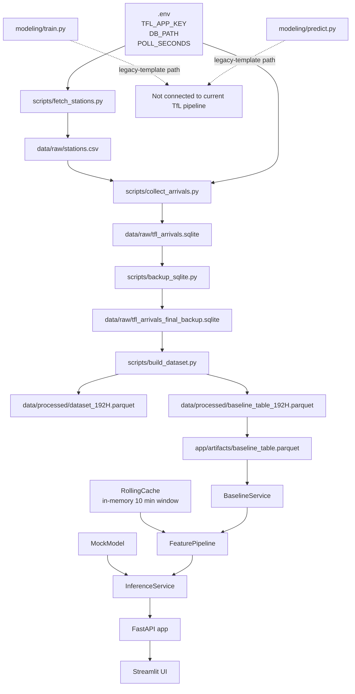
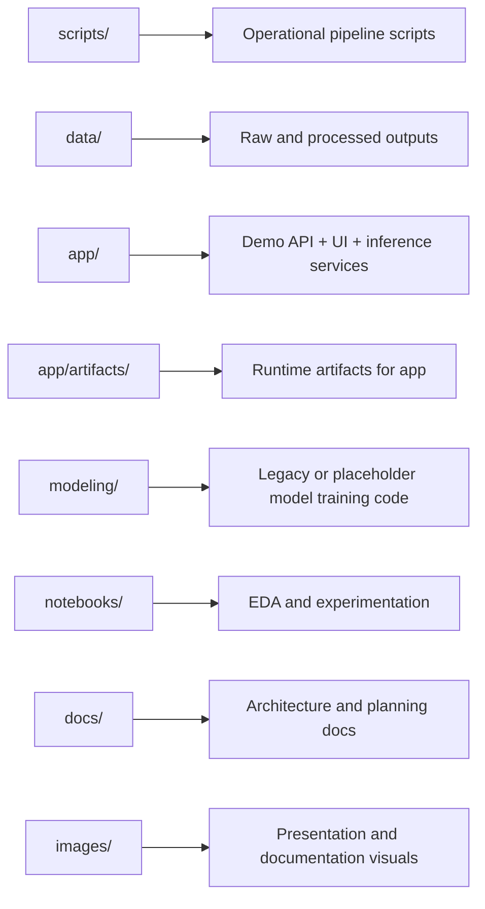
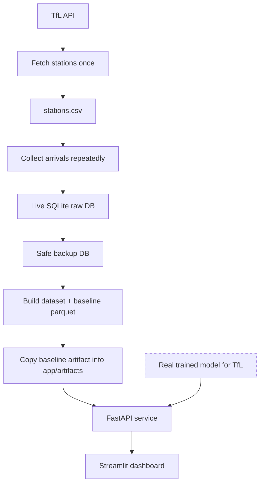

# Current Project Workflow

This document describes how the repository is managed right now based on the code that is currently present.

It separates:

- the active data pipeline
- the current demo application flow
- the parts that look unfinished, mocked, or legacy

## 1. Current State At A Glance

## 2. Main Repository Flow

### A. Data ingestion

This is the most concrete and operational part of the repo today.

1. `scripts/fetch_stations.py`
   Creates `data/raw/stations.csv` from the TfL API for Victoria and Jubilee line stops.
2. `scripts/collect_arrivals.py`
   Reads `stations.csv`, polls the TfL arrivals endpoint, and writes raw snapshots into SQLite.
3. `scripts/backup_sqlite.py`
   Creates a safe backup copy of the live SQLite database using SQLite's backup API.

### B. Dataset creation

This is the current bridge from raw API data to ML-ready data.

1. `scripts/build_dataset.py`
   Reads the backup SQLite database.
2. It filters the recent development window.
3. It builds:
   - time features
   - rolling 10-minute statistics
   - baseline median table
   - `late` label
4. It writes:
   - `data/processed/dataset_192H.parquet`
   - `data/processed/baseline_table_192H.parquet`

### C. Application/demo layer

This part is implemented, but it is still partly a demo stack rather than a fully trained production ML stack.

1. `app/bootstrap.py`
   Wires the services together.
2. `BaselineService`
   Loads `app/artifacts/baseline_table.parquet`.
3. `RollingCache`
   Stores recent observations in memory for rolling stats.
4. `FeaturePipeline`
   Converts one incoming row into model features.
5. `MockModel`
   Produces a probability from a simple rule, not from a trained artifact.
6. `InferenceService`
   Converts the probability into:
   - risk level
   - explanation text
   - display payload
7. `app/api/main.py`
   Exposes `/health`, `/sample`, and `/predict`.
8. `app/ui/streamlit_app.py`
   Calls the FastAPI service and renders the result.

## 3. Folder Responsibility Map

## 4. What Looks Active Vs Inactive

### Active or mostly active

- `scripts/fetch_stations.py`
- `scripts/collect_arrivals.py`
- `scripts/backup_sqlite.py`
- `scripts/build_dataset.py`
- `app/bootstrap.py`
- `app/services/*`
- `app/api/main.py`
- `app/ui/streamlit_app.py`

### Implemented but still demo/mocked

- `app/services/mock_model.py`
- `app/artifacts/model.joblib`

Notes:

- `model.joblib` exists but is empty right now.
- The app does not load a real trained model yet.
- The live app path currently depends on the baseline parquet plus a mock risk model.

### Likely legacy or template code

- `modeling/train.py`
- `modeling/predict.py`
- parts of `modeling/feature_engineering.py`

Why:

- these files use coffee-quality example data rather than the TfL dataset
- they are not wired into the `app/` inference stack
- they do not produce the runtime artifact currently used by the API

## 5. How The Project Is Managed Right Now

In simple terms, the repository currently behaves like this:

1. Collect real-time TfL data into SQLite.
2. Create a safer backup copy for downstream work.
3. Build a training-style dataset and a baseline lookup table.
4. Feed the baseline lookup table into the demo app.
5. Run the API and Streamlit app with a mocked prediction model.

So the project is already split into three practical layers:

- data collection
- feature and dataset building
- demo inference and visualization

The missing link is the real model training and deployment handoff.

## 6. Current Gaps In The Workflow

These are the biggest workflow gaps visible in the repo today:

- no real trained TfL model is connected to the API
- `app/artifacts/model.joblib` is empty
- `modeling/` is not aligned with the TfL pipeline yet
- there is no single command that runs the full end-to-end pipeline
- the baseline artifact used by the app appears to be copied manually from processed outputs

## 7. Practical End-To-End View

The dashed box above represents the missing production ML handoff that still needs to be completed.
