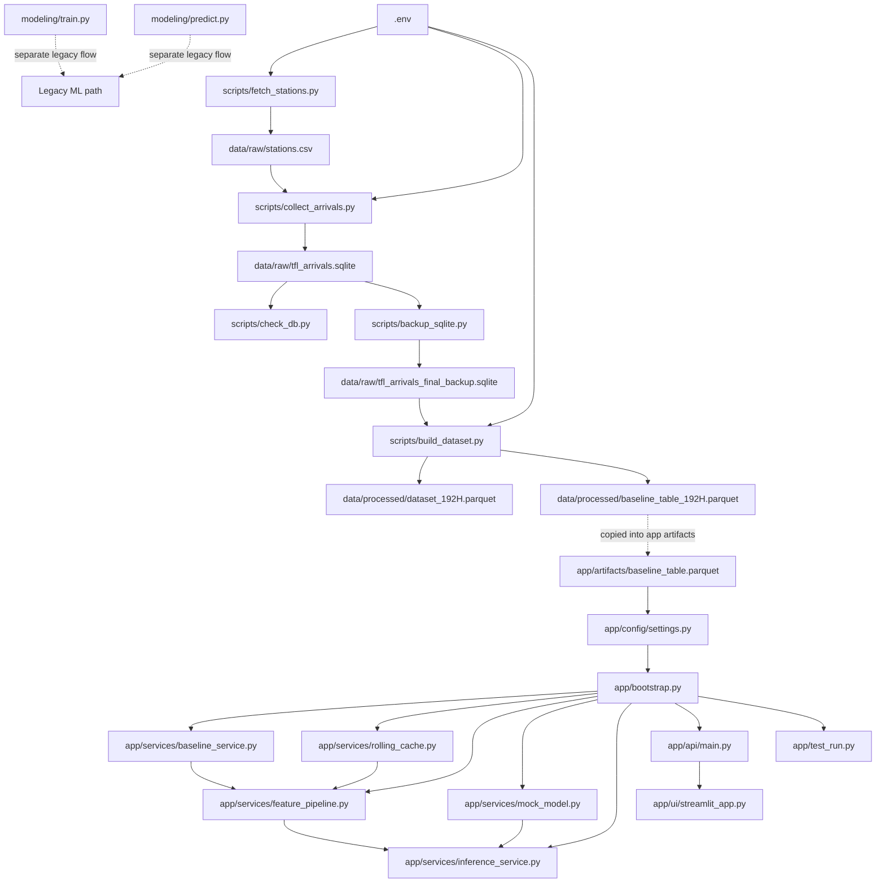
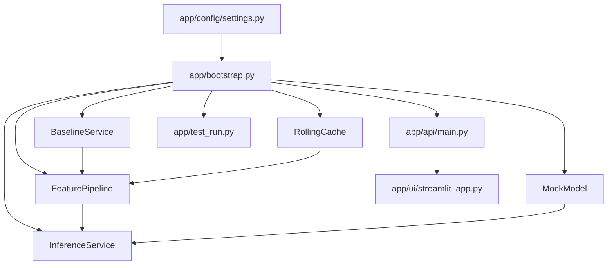

# File Dependency Map

This document maps how the important files depend on each other right now.

It focuses on:

- code imports
- read/write relationships
- runtime flow between scripts, artifacts, API, and UI

It does not try to show every package dependency from `requirements.txt`.

## 1. End-to-End Dependency Flow

## 2. Script-Level Read/Write Map

### `scripts/fetch_stations.py`

- Reads:
  - `.env`
  - TfL API
- Writes:
  - `data/raw/stations.csv`
- Purpose:
  - bootstrap the list of stations/stops for later collection

### `scripts/collect_arrivals.py`

- Reads:
  - `.env`
  - `data/raw/stations.csv`
  - TfL API
- Writes:
  - `data/raw/tfl_arrivals.sqlite`
- Purpose:
  - collect repeated arrival snapshots into SQLite

### `scripts/check_db.py`

- Reads:
  - `data/raw/tfl_arrivals.sqlite`
- Writes:
  - none
- Purpose:
  - inspect the raw SQLite DB

### `scripts/backup_sqlite.py`

- Reads:
  - `data/raw/tfl_arrivals.sqlite`
- Writes:
  - `data/raw/tfl_arrivals_final_backup.sqlite`
- Purpose:
  - create a safe snapshot for downstream reads

### `scripts/build_dataset.py`

- Reads:
  - `data/raw/tfl_arrivals_final_backup.sqlite`
- Writes:
  - `data/processed/dataset_192H.parquet`
  - `data/processed/baseline_table_192H.parquet`
- Purpose:
  - create ML dataset, rolling features, baseline lookup, and labels

## 3. App Dependency Map

### `app/config/settings.py`

- Defines:
  - `ARTIFACTS_DIR`
  - `BASELINE_TABLE_PATH`
  - `MODEL_PATH`
- Used by:
  - `app/bootstrap.py`

### `app/bootstrap.py`

- Imports:
  - `BaselineService`
  - `RollingCache`
  - `FeaturePipeline`
  - `MockModel`
  - `InferenceService`
- Reads:
  - path config from `app/config/settings.py`
- Creates:
  - the service container for the app

### `app/services/baseline_service.py`

- Reads:
  - `app/artifacts/baseline_table.parquet`
- Provides:
  - baseline lookup by stop, line, direction, hour, weekday

### `app/services/rolling_cache.py`

- Stores:
  - in-memory rolling observations
- Provides:
  - mean, max, count over the recent 10-minute window

### `app/services/feature_pipeline.py`

- Reads from:
  - incoming API row
  - `BaselineService`
  - `RollingCache`
- Produces:
  - the feature dict used for inference

### `app/services/mock_model.py`

- Reads:
  - feature dict generated by the pipeline
- Produces:
  - mock `predict_proba()` output

### `app/services/inference_service.py`

- Reads from:
  - `FeaturePipeline`
  - `MockModel`
- Produces:
  - probability
  - risk level
  - explanation text
  - UI/API-ready response payload

### `app/api/main.py`

- Imports:
  - `create_services()` from `app/bootstrap.py`
- Exposes:
  - `/health`
  - `/sample`
  - `/predict`

### `app/ui/streamlit_app.py`

- Calls:
  - FastAPI endpoints on `http://127.0.0.1:8000`
- Reads:
  - API response only
- Produces:
  - dashboard/demo display

### `app/test_run.py`

- Imports:
  - `create_services()` from `app/bootstrap.py`
- Purpose:
  - quick local inference test without starting the API

## 4. Python Import Relationships

### App imports

- `app/api/main.py` -> `app/bootstrap.py`
- `app/bootstrap.py` -> `app/config/settings.py`
- `app/bootstrap.py` -> `app/services/baseline_service.py`
- `app/bootstrap.py` -> `app/services/rolling_cache.py`
- `app/bootstrap.py` -> `app/services/feature_pipeline.py`
- `app/bootstrap.py` -> `app/services/mock_model.py`
- `app/bootstrap.py` -> `app/services/inference_service.py`
- `app/test_run.py` -> `app/bootstrap.py`

### Modeling imports

- `modeling/train.py` -> `modeling/feature_engineering.py`
- `modeling/train.py` -> `modeling/config.py`
- `modeling/predict.py` -> `modeling/feature_engineering.py`

### Scripts

- the `scripts/` files are mostly standalone and connect through data files rather than Python imports

## 5. Important Reality Check

### Connected current path

The currently connected practical path is:

1. `scripts/fetch_stations.py`
2. `scripts/collect_arrivals.py`
3. `scripts/backup_sqlite.py`
4. `scripts/build_dataset.py`
5. `app/artifacts/baseline_table.parquet`
6. `app/bootstrap.py`
7. `app/api/main.py`
8. `app/ui/streamlit_app.py`

### Disconnected or incomplete path

The current incomplete path is:

1. `modeling/train.py`
2. trained TfL model artifact
3. `app/artifacts/model.joblib`
4. real model loading inside app services

Why incomplete:

- `modeling/train.py` still uses coffee-quality example data
- `app/artifacts/model.joblib` exists but is empty
- the app currently uses `MockModel` instead of a real saved model

## 6. Files That Are Important But Not Yet Properly Linked

- `docs/ml_integration_contract.md`
  - describes the handoff needed from modeling to inference
- `modeling/train.py`
  - should eventually produce a real TfL model artifact
- `app/config/settings.py`
  - already points to `app/artifacts/model.joblib`, but that artifact is not active yet
- `app/api/routes.py`
  - currently empty, so all API behavior lives in `app/api/main.py`

## 7. Summary

If you want the simplest way to think about dependencies in this repo:

- `scripts/` communicate mainly through generated files
- `app/` communicates mainly through Python imports and service wiring
- `modeling/` currently lives off to the side and is not yet integrated into the real TfL app flow
