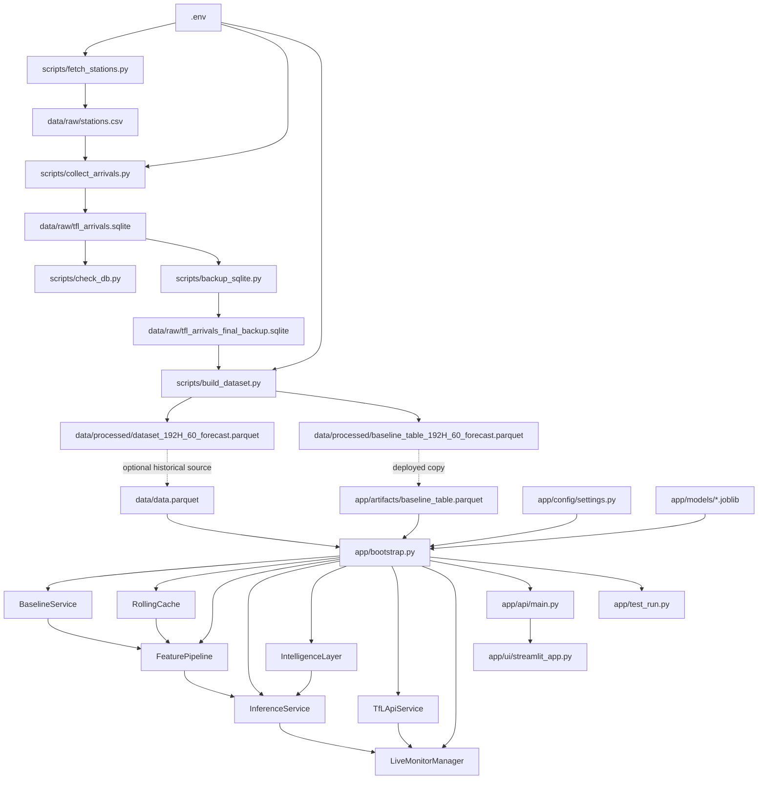
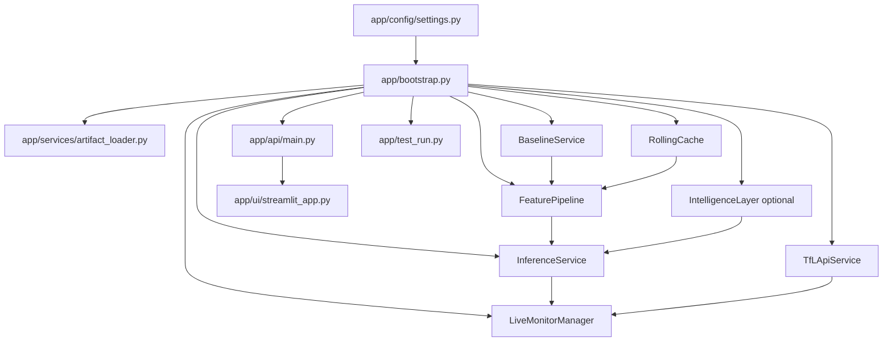

# File Dependency Map

This document maps how the important files depend on each other right now.

It focuses on:

- Python import relationships
- file read and write paths
- runtime interactions between scripts, artifacts, API, and UI

It does not attempt to list every package dependency from `requirements.txt`.

## 1. End-to-End Dependency Flow

## 2. Script-Level Read and Write Map

### `scripts/fetch_stations.py`

- Reads:
  - `.env`
  - TfL API
- Writes:
  - `data/raw/stations.csv`
- Purpose:
  - bootstrap station metadata for collection

### `scripts/collect_arrivals.py`

- Reads:
  - `.env`
  - `data/raw/stations.csv`
  - TfL API
- Writes:
  - `data/raw/tfl_arrivals.sqlite`
- Purpose:
  - store repeated arrival snapshots in SQLite

### `scripts/check_db.py`

- Reads:
  - `data/raw/tfl_arrivals.sqlite`
- Writes:
  - none
- Purpose:
  - inspect the raw snapshot database

### `scripts/backup_sqlite.py`

- Reads:
  - `data/raw/tfl_arrivals.sqlite`
- Writes:
  - `data/raw/tfl_arrivals_final_backup.sqlite`
- Purpose:
  - create a stable snapshot for offline processing

### `scripts/build_dataset.py`

- Reads:
  - `data/raw/tfl_arrivals_final_backup.sqlite`
- Writes:
  - `data/processed/dataset_192H_60_forecast.parquet`
  - `data/processed/baseline_table_192H_60_forecast.parquet`
  - potentially other processed dataset variants already present in `data/processed/`
- Purpose:
  - build forecasting-ready training data and baseline lookup tables

## 3. Runtime Application Dependency Map

## 4. Key Runtime Files

### `app/config/settings.py`

- Defines:
  - `BASE_DIR`
  - `ARTIFACTS_DIR`
  - `BASELINE_TABLE_PATH`
  - `MODEL_PATH`
  - `MODEL_FEATURES`
  - alert modes and default alert mode
  - feature flags for intelligence and mock mode
- Used by:
  - `app/bootstrap.py`
  - `app/services/inference_service.py`

### `app/bootstrap.py`

- Imports:
  - runtime configuration
  - `BaselineService`
  - `RollingCache`
  - `FeaturePipeline`
  - `InferenceService`
  - `TfLApiService`
  - `LiveMonitorManager`
  - `load_model_artifact`
  - `MockModel`
- Reads:
  - `app/artifacts/baseline_table.parquet`
  - configured model file from `app/models/`
  - `data/data.parquet` when intelligence is enabled
- Creates:
  - the service container used by both API and local test entrypoints

### `app/services/artifact_loader.py`

- Reads:
  - selected `.joblib` model artifact
  - optional sidecar metadata and feature-contract JSON files
- Provides:
  - a normalized loaded model object with feature order, input type, and metadata

### `app/services/baseline_service.py`

- Reads:
  - `app/artifacts/baseline_table.parquet`
- Provides:
  - baseline values for station, line, direction, hour, and weekday combinations

### `app/services/rolling_cache.py`

- Stores:
  - in-memory recent arrivals
- Provides:
  - rolling mean, max, and count for the recent time window

### `app/services/feature_pipeline.py`

- Reads from:
  - incoming arrival row
  - `BaselineService`
  - `RollingCache`
- Produces:
  - model features
  - display context

### `app/services/inference_service.py`

- Reads from:
  - `FeaturePipeline`
  - loaded model artifact or mock model
  - optional `IntelligenceLayer`
- Produces:
  - probability
  - risk label
  - alert flag
  - explanation text
  - model metadata in response
  - optional intelligence block

### `app/services/tfl_api_service.py`

- Calls:
  - TfL Arrivals API
- Produces:
  - normalized live arrival rows for monitored stops

### `app/services/live_monitor_manager.py`

- Reads from:
  - `TfLApiService`
  - `InferenceService`
- Produces:
  - latest live predictions
  - monitor status metadata
  - warmup state

### `app/api/main.py`

- Imports:
  - `create_services()` from `app/bootstrap.py`
  - `DEFAULT_MONITORED_STOPS` from `app/services/tfl_api_service.py`
- Exposes:
  - `GET /health`
  - `GET /sample`
  - `POST /predict`
  - `GET /monitor/live`
  - `GET /monitor/status`
  - `POST /monitor/refresh`

### `app/ui/streamlit_app.py`

- Calls:
  - FastAPI endpoints over HTTP
- Uses:
  - `GET /health` to show system status
  - `GET /monitor/live` and `POST /monitor/refresh` for live mode
  - in-app curated payloads for showcase demo mode
- Produces:
  - the product dashboard

### `app/test_run.py`

- Imports:
  - `create_services()` from `app/bootstrap.py`
- Purpose:
  - quick local service-level inference check

## 5. Python Import Relationships

### App imports

- `app/api/main.py` -> `app/bootstrap.py`
- `app/api/main.py` -> `app/services/tfl_api_service.py`
- `app/bootstrap.py` -> `app/config/settings.py`
- `app/bootstrap.py` -> `app/services/artifact_loader.py`
- `app/bootstrap.py` -> `app/services/baseline_service.py`
- `app/bootstrap.py` -> `app/services/rolling_cache.py`
- `app/bootstrap.py` -> `app/services/feature_pipeline.py`
- `app/bootstrap.py` -> `app/services/inference_service.py`
- `app/bootstrap.py` -> `app/services/mock_model.py`
- `app/bootstrap.py` -> `app/services/tfl_api_service.py`
- `app/bootstrap.py` -> `app/services/live_monitor_manager.py`
- `app/test_run.py` -> `app/bootstrap.py`
- `app/services/intelligence_layer.py` -> `app/services/explanation_utils.py`
- `app/services/intelligence_layer.py` -> `app/services/retrieval_utils.py`

### Modeling imports

- `modeling/train.py` -> `modeling/feature_engineering.py`
- `modeling/train.py` -> `modeling/config.py`
- `modeling/predict.py` -> `feature_engineering.py`
- `modeling/validate_model_artifact.py` -> `app/services/artifact_loader.py`

### Scripts

- the scripts mostly communicate through generated files rather than Python imports

## 6. Reality Check: Connected vs Legacy Paths

### Connected current path

The currently connected product path is:

1. `scripts/fetch_stations.py`
2. `scripts/collect_arrivals.py`
3. `scripts/backup_sqlite.py`
4. `scripts/build_dataset.py`
5. `app/artifacts/baseline_table.parquet`
6. `app/models/lightgbm_v2_h300_balanced.joblib`
7. `app/bootstrap.py`
8. `app/api/main.py`
9. `app/ui/streamlit_app.py`

### Partially disconnected or legacy path

The partially disconnected path is:

1. `modeling/train.py`
2. `modeling/predict.py`
3. top-level `models/`
4. `app/artifacts/model.joblib`

Why it is considered legacy or incomplete:

- the active runtime does not load `app/artifacts/model.joblib`
- the deployed app is already pointed at `app/models/*.joblib`
- the modeling area is not yet the clean source of truth for the shipped runtime artifact

## 7. Summary

The simplest way to think about the current repository is:

- `scripts/` communicate through files and build datasets
- `app/` communicates through Python imports and service composition
- `app/ui/streamlit_app.py` uses the API as a client
- `modeling/` still exists, but only part of it is aligned with the current deployment path
