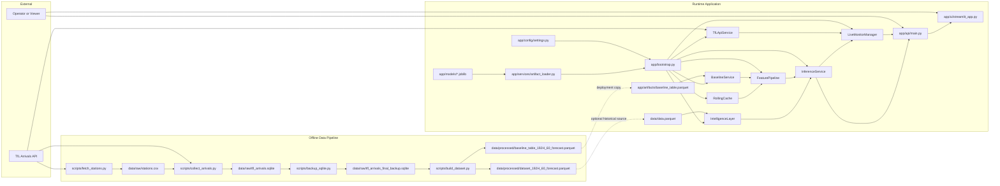

# Repository Architecture

This document reflects the current structure and runtime behavior of the DelaySense repository as of the capstone final product state.

It covers:

- the live product path used by the FastAPI backend and Streamlit dashboard
- the offline data pipeline used to collect TfL arrivals and prepare historical datasets
- the repository areas that are current, transitional, or legacy

## 1. Executive Summary

DelaySense is organized around one practical product flow:

1. collect London Underground arrival snapshots from the TfL Arrivals API
2. store raw snapshots in SQLite
3. build feature-rich Parquet datasets and a baseline lookup table
4. package or select a trained model artifact for runtime scoring
5. serve predictions and live monitor state through FastAPI
6. present either curated showcase scenarios or live monitoring results through Streamlit

The active deployment surface is `app/`.

The active offline data pipeline lives in `scripts/`.

The `modeling/` directory is only partially aligned with the deployed product:

- `validate_model_artifact.py` is aligned with the app contract
- the other modeling files still represent an older training workflow and are not the main runtime path

## 2. High-Level Architecture

## 3. Runtime Application Architecture

### Composition root

`app/bootstrap.py` is the composition root for the deployed application. It is responsible for:

- loading configuration from `app/config/settings.py`
- loading the baseline table
- loading the selected model artifact from `app/models/`
- smoke-testing the model input contract
- optionally enabling the intelligence layer from `data/data.parquet`
- wiring the live monitor manager and inference service together

### Runtime services

- `BaselineService`
  - reads `app/artifacts/baseline_table.parquet`
  - provides fallback-aware baseline lookup by stop, line, direction, hour, and weekday
- `RollingCache`
  - maintains recent live context in memory
  - enables rolling short-window features for active monitoring
- `FeaturePipeline`
  - transforms a raw arrival row into model-ready features plus display context
- `InferenceService`
  - builds model input in the correct feature order
  - scores `predict_proba()`
  - applies alert mode thresholds
  - returns API-ready prediction payloads
- `TfLApiService`
  - fetches and normalizes live arrivals from the TfL API
  - filters to currently supported lines and monitored stops
- `LiveMonitorManager`
  - polls TfL on a background thread
  - scores each live arrival through `InferenceService`
  - stores the latest live state and monitor status
- `IntelligenceLayer`
  - optional enrichment using historical dataset lookups
  - adds narrative and similar-case context when enabled

### Runtime model loading

The current deployed model path is configured in `app/config/settings.py`:

- `MODEL_PATH = app/models/lightgbm_v2_h300_balanced.joblib`

The application does not depend on `app/artifacts/model.joblib` for the active runtime path. That file currently exists as a zero-byte placeholder and should be treated as legacy or unused.

The loader in `app/services/artifact_loader.py` supports:

- plain joblib model objects
- packaged payloads containing a pipeline plus metadata
- sidecar metadata and feature-contract JSON files when present

## 4. Runtime Request Flows

### 4.1 API startup flow

1. `app/api/main.py` imports `create_services()` from `app/bootstrap.py`
2. services are created immediately at import time
3. FastAPI lifespan startup starts the `LiveMonitorManager` background thread
4. live monitoring begins polling TfL every 30 seconds

### 4.2 Direct prediction flow

1. client sends `POST /predict`
2. `app/api/main.py` validates request payload with `PredictRequest`
3. `InferenceService.predict()` calls `FeaturePipeline.build()`
4. the model artifact scores the feature vector
5. alert thresholds are applied for the chosen mode
6. response returns:
   - probability
   - risk label
   - alert flag
   - explanation text
   - display fields
   - model feature values
   - optional intelligence payload

### 4.3 Live monitoring flow

1. `LiveMonitorManager` polls `TfLApiService`
2. each normalized arrival row is scored through `InferenceService`
3. results are sorted by probability and deviation-from-baseline severity
4. FastAPI exposes current monitor state through:
   - `GET /monitor/live`
   - `GET /monitor/status`
   - `POST /monitor/refresh`

### 4.4 Dashboard flow

The dashboard in `app/ui/streamlit_app.py` is an HTTP client of the API, not a direct importer of the service layer.

It supports two user-facing modes:

- `Showcase demo`
  - uses curated in-app sample payloads for presentation and product storytelling
- `Live TfL`
  - pulls active monitor state and status from the FastAPI backend

The dashboard also exposes alert sensitivity choices:

- Conservative
- Balanced
- Sensitive

## 5. Offline Data Pipeline

### Pipeline responsibilities

- `scripts/fetch_stations.py`
  - retrieves and stores station metadata
- `scripts/collect_arrivals.py`
  - polls TfL arrivals and appends snapshots into SQLite
- `scripts/backup_sqlite.py`
  - creates a safe snapshot copy for downstream processing
- `scripts/build_dataset.py`
  - constructs forecasting-ready datasets and baseline tables from the snapshot database
- `scripts/check_db.py`
  - inspects the raw SQLite store for sanity checks

## 6. Repository Zones

### Active product code

- `app/`
- `scripts/`
- `docs/` files that describe the deployed app and repo structure
- `data/sample_data.parquet` as a lightweight shareable sample dataset

### Active runtime artifacts

- `app/models/*.joblib`
- `app/artifacts/baseline_table.parquet`
- `data/data.parquet` when intelligence mode is enabled

### Transitional or legacy areas

- `modeling/train.py`
- `modeling/predict.py`
- `modeling/feature_engineering.py`
- `modeling/config.py`
- `app/artifacts/model.joblib`
- the top-level `models/` directory

These areas still contain useful historical work, but they are not the cleanest path to understanding the deployed system today.

## 7. Key Architectural Observations

- The runtime product is cleanly split into configuration, service wiring, API, and UI layers.
- The Streamlit dashboard is properly decoupled from backend internals through HTTP calls.
- The live monitor path depends on rolling warm-up because recent context is built in memory over time.
- Baseline lookup is precomputed and file-based, which keeps online inference lightweight.
- Real model artifacts are already integrated into the active runtime path through `app/models/`.
- Historical intelligence is optional and guarded so the app can still run if `data/data.parquet` is absent.
- The largest remaining architectural inconsistency is the older modeling area, which is not yet fully aligned with the deployed TfL forecasting stack.

## 8. Recommended Mental Model

For onboarding, the clearest way to understand the current repository is:

1. `scripts/` creates raw and processed data assets
2. `app/artifacts/` and `app/models/` provide runtime inputs
3. `app/bootstrap.py` wires the app together
4. `app/api/main.py` exposes prediction and live-monitor endpoints
5. `app/ui/streamlit_app.py` presents the product in demo or live mode

That is the current working architecture of DelaySense.
