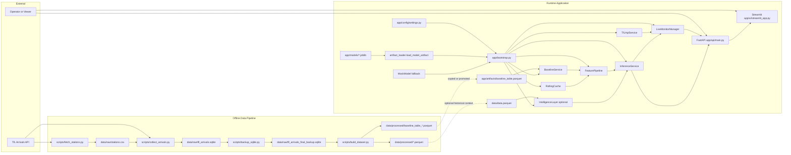
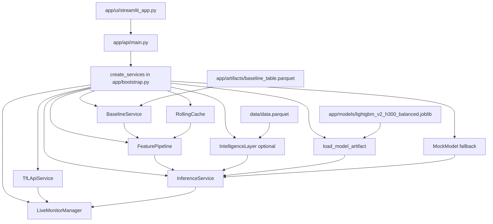
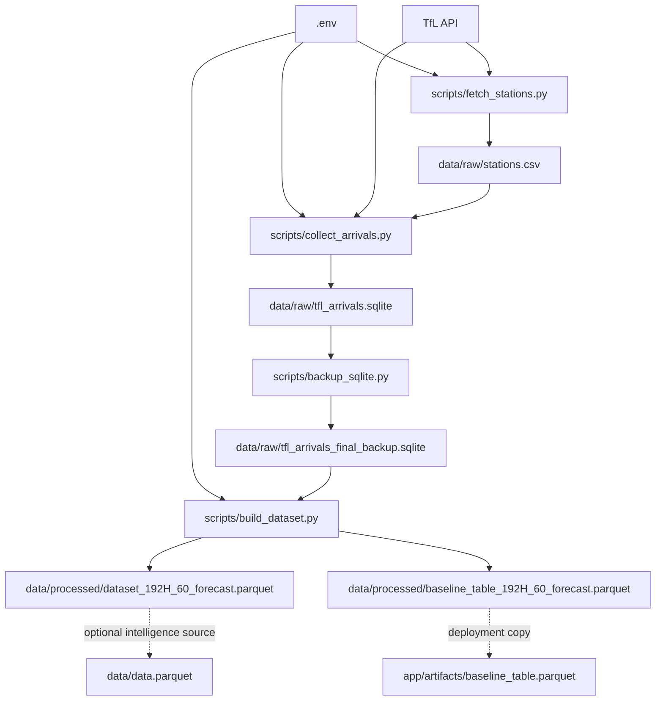

# Repository Architecture

This document captures the actual architecture of the current repository, including both:

- the deployed runtime path used by the FastAPI + Streamlit app
- the offline data pipeline used to collect TfL arrivals and build feature tables

It also calls out the parts of the repo that appear legacy or only partially integrated.

## 1. Executive Summary

The repository is organized around one main product flow:

1. collect live TfL arrival snapshots
2. store them in SQLite
3. build a processed Parquet dataset plus a baseline lookup table
4. load a packaged model artifact and baseline table into the app
5. serve predictions through FastAPI
6. visualize and inspect them in Streamlit

The `app/` directory is the active deployment surface.

The `scripts/` directory drives ingestion and dataset creation.

The `modeling/` directory is mixed: `validate_model_artifact.py` matches the deployed artifact contract, but `train.py` and `predict.py` still look like template-era code and do not represent the active TfL training pipeline.

## 2. High-Level Architecture Diagram

## 3. Runtime Component Diagram

## 4. Runtime Flow

### 4.1 App startup

- `app/api/main.py` imports `create_services()` from `app/bootstrap.py`.
- `app/bootstrap.py` reads runtime paths and flags from `app/config/settings.py`.
- It initializes:
  - `BaselineService`
  - `RollingCache`
  - `FeaturePipeline`
  - model artifact loading through `artifact_loader.py`
  - optional `IntelligenceLayer`
  - `InferenceService`
  - `TfLApiService`
  - `LiveMonitorManager`
- A smoke test is executed against the loaded model before the app serves requests.

### 4.2 Live monitoring path

- `LiveMonitorManager` polls `TfLApiService` on a background thread.
- `TfLApiService` fetches and normalizes arrivals for selected stations.
- Each live row is passed to `InferenceService.predict(...)`.
- `InferenceService` uses:
  - `FeaturePipeline` to build feature values
  - `BaselineService` for station-line-direction-hour-weekday baselines
  - `RollingCache` for live short-window aggregates
  - the loaded model artifact for `predict_proba()`
  - optional `IntelligenceLayer` for historical context and narrative output
- Sorted predictions are exposed through:
  - `GET /monitor/live`
  - `GET /monitor/status`
  - `POST /monitor/refresh`

### 4.3 Dashboard path

- `app/ui/streamlit_app.py` calls the FastAPI backend over HTTP.
- It can run in:
  - showcase demo mode
  - live TfL mode
- The dashboard is a client of the API, not a direct importer of the service layer.

## 5. Offline Data Pipeline

## 6. Repository Boundaries

### Active product code

- `app/`
- `scripts/`
- selected files in `docs/`

### Mixed or legacy area

- `modeling/train.py`
- `modeling/predict.py`
- `modeling/feature_engineering.py`
- `modeling/config.py`

These files still reference a coffee-quality example workflow and MLflow template configuration rather than the current TfL forecasting pipeline.

### Still aligned with the current app contract

- `modeling/validate_model_artifact.py`
- `app/services/artifact_loader.py`
- `app/models/*.joblib`
- `docs/ml_integration_contract.md`

## 7. Key File Responsibilities

- `app/bootstrap.py`: composition root for the deployed system.
- `app/config/settings.py`: runtime paths, model feature contract, alert thresholds, feature flags.
- `app/services/baseline_service.py`: baseline lookup with fallback logic.
- `app/services/rolling_cache.py`: in-memory rolling state for live inference.
- `app/services/feature_pipeline.py`: transforms a raw arrival row into model-ready features plus display context.
- `app/services/inference_service.py`: model scoring, risk labeling, alert logic, response assembly.
- `app/services/live_monitor_manager.py`: background polling and latest-results state manager.
- `app/services/tfl_api_service.py`: live TfL HTTP client and payload normalization.
- `app/services/intelligence_layer.py`: optional explanation and similar-case enrichment from historical data.
- `scripts/collect_arrivals.py`: repeated ingestion of live arrivals into SQLite.
- `scripts/build_dataset.py`: processed feature dataset and baseline-table creation.

## 8. Architectural Observations

- The app is reasonably well separated into composition, services, API, and UI layers.
- The FastAPI backend and Streamlit frontend are decoupled cleanly through HTTP.
- The live feature path depends on in-memory warmup because `RollingCache` builds recent context only after polling begins.
- Baseline lookup depends on a precomputed Parquet table rather than querying historical raw data at inference time.
- Model loading is robust because `artifact_loader.py` supports metadata, feature order, input type, and packaged payload detection.
- The repo currently contains two model-storage zones:
  - `app/models/` for runtime deployment
  - `models/` for older or auxiliary artifacts
- The biggest architectural inconsistency is the gap between the active TfL app and the older template-style files under `modeling/`.

## 9. Recommended Mental Model

If someone new joins the project, the cleanest way to understand the system is:

1. `scripts/` builds the data assets
2. `app/artifacts/` and `app/models/` feed the runtime
3. `app/bootstrap.py` wires everything together
4. `app/api/main.py` exposes the service layer
5. `app/ui/streamlit_app.py` presents the results

That is the current real architecture of this repository.
